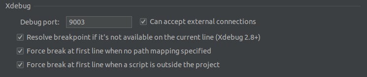
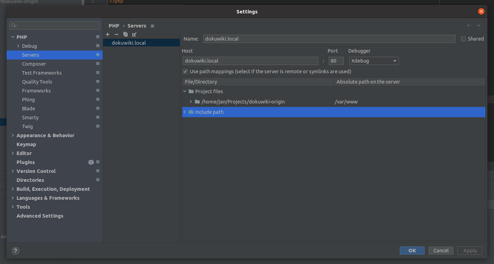

# DokuWiki 🤝 Docker

### A dockerized Set-up for DokuWiki development

This Set-up was created to make development around DokuWiki easier and more maintainable. Just fork the original repo 
[splitbrain/dokuwiki](https://github.com/splitbrain/dokuwiki) and start playing around 🚀

###### 🧱 PHP 7.4 FPM | Composer (latest) | Xdebug (latest) | Nginx 1.8 Alpine

#### Prerequisites
1. Make sure you have docker & docker-compose set-up.
2. Add `127.0.0.1 dokuwiki.local` in your _/etc/hosts_.   
   ℹ This is optional - you can customize the hostname in _server/dokuwiki.conf_
3. Create an _.env_ file and set up environmental variables accordingly.  
   ⤷ `cp .env.example .env`

#### First run

Go to [/install.php](http://dokuwiki.local/install.php) and perform the standard DokuWiki install process.

#### Xdebug in PHP Storm

###### Xdebug Port Settings

###### Server Path Mappings

